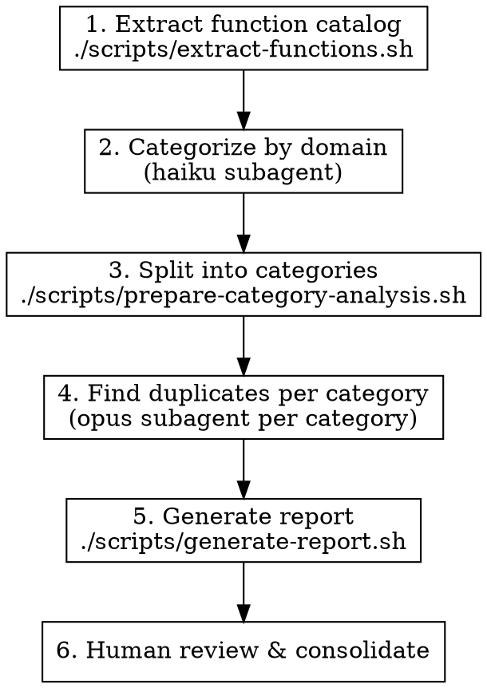

# 查找意图重复的函数

## 概述

LLM 生成的代码库会积累语义重复：一些函数承担相同目的，但却被独立实现。传统的复制粘贴检测器（jscpd）能发现语法层面的重复，却会漏掉“意图相同、实现不同”的情况。

这个技能采用两阶段方法：先做传统提取，再用 LLM 进行意图聚类。

## 何时使用

- 代码库由多个贡献者（人类或 LLM）逐步自然演化而来
- 你怀疑某些工具函数被重复实现了多次
- 在进行大型重构之前，希望识别可合并的机会
- 已经运行过 `jscpd`，并且语法重复已经处理完毕之后

## 快速参考

| 阶段 | 工具 | 模型 | 输出 |
|------|------|------|------|
| 1. 提取 | `scripts/extract-functions.sh` | - | `catalog.json` |
| 2. 分类 | `scripts/categorize-prompt.md` | haiku | `categorized.json` |
| 3. 拆分 | `scripts/prepare-category-analysis.sh` | - | `categories/*.json` |
| 4. 检测 | `scripts/find-duplicates-prompt.md` | opus | `duplicates/*.json` |
| 5. 报告 | `scripts/generate-report.sh` | - | `report.md` |

## 流程



### 阶段 1：提取函数目录

```bash
./scripts/extract-functions.sh src/ -o catalog.json
```

选项：
- `-o FILE`：输出文件（默认：stdout）
- `-c N`：捕获的上下文行数（默认：15）
- `-t GLOB`：文件类型（默认：`*.ts,*.tsx,*.js,*.jsx`）
- `--include-tests`：包含测试文件（默认排除）

测试文件（`*.test.*`、`*.spec.*`、`__tests__/**`）默认会被排除，因为测试工具函数通常不太可能成为合并候选项。

### 阶段 2：按领域分类

使用 `scripts/categorize-prompt.md` 中的 prompt，派发一个 **haiku** 子代理。

把 `catalog.json` 的内容插入到 prompt 模板指定的位置。将输出保存为 `categorized.json`。

### 阶段 3：拆分为分类文件

```bash
./scripts/prepare-category-analysis.sh categorized.json ./categories
```

每个分类会生成一个 JSON 文件。只有包含 3 个以上函数的分类才值得分析。

### 阶段 4：查找重复项（按分类）

对 `./categories/` 中的每个分类文件，使用 `scripts/find-duplicates-prompt.md` 中的 prompt，派发一个 **opus** 子代理。

将每个输出保存为 `./duplicates/{category}.json`。

### 阶段 5：生成报告

```bash
./scripts/generate-report.sh ./duplicates ./duplicates-report.md
```

生成一个按置信度分组、并带有优先级的 Markdown 报告。

### 阶段 6：人工审查

审查报告。对于 HIGH 置信度的重复项：
1. 确认推荐保留的函数已有测试覆盖
2. 更新调用方，改为使用保留函数
3. 删除重复函数
4. 运行测试

## 高风险重复区域

优先针对这些区域进行提取，它们最容易积累重复实现：

| 区域 | 常见重复类型 |
|------|--------------|
| `utils/`、`helpers/`、`lib/` | 通用工具函数被重复实现 |
| 校验代码 | 相同检查逻辑用多种方式重复书写 |
| 错误格式化 | 错误对象到字符串的转换 |
| 路径处理 | 路径拼接、解析、规范化 |
| 字符串格式化 | 大小写转换、截断、转义 |
| 日期格式化 | 相同格式被反复实现 |
| API 响应整形 | 不同端点上的相似转换逻辑 |

## 常见错误

**提取过多内容**：聚焦导出函数和公共方法。内部辅助函数通常不太可能在多个文件间重复。

**跳过分类步骤**：直接对完整目录做重复检测会产生大量噪音。分类能让比较更聚焦。

**用 haiku 做重复检测**：Haiku 适合做低成本分类，但会漏掉细微的语义重复。真正的重复分析应使用 Opus。

**没有测试就合并**：在删除重复函数前，确保保留函数的测试覆盖了被删除函数的所有使用场景。
